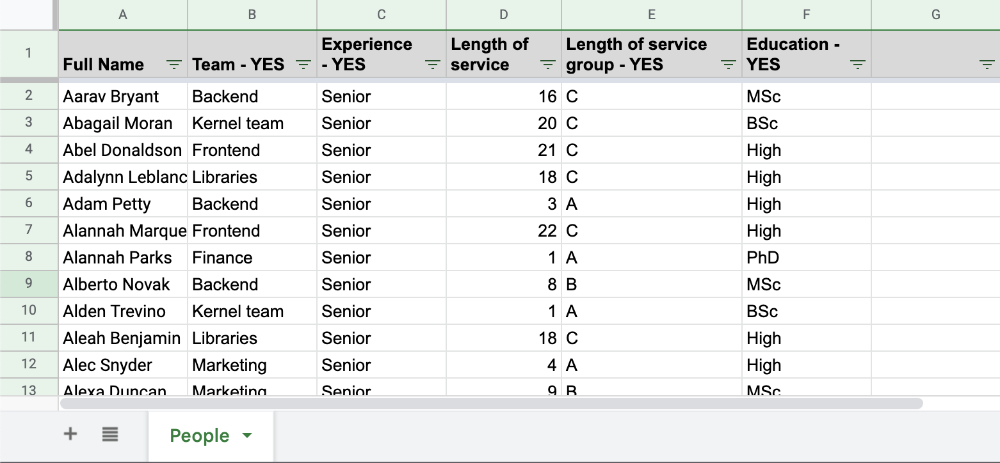
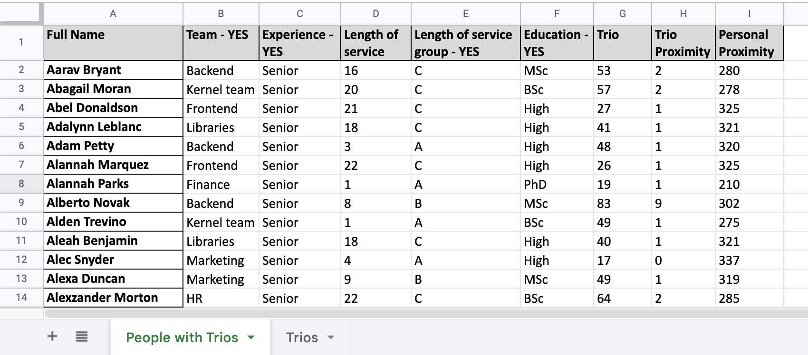
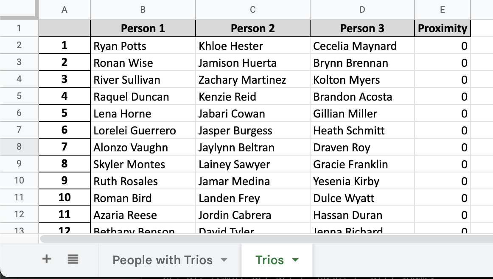

# Entangled Trios Generator

Entangled Trios Generator is a tool that generates trios of people from an Excel file that describes their
characteristics. The trios are generated in a way that tries to maximize diversty of people in each trio.

Such trios are used in an [Entagled Trios](https://cynefin.io/wiki/Entangled_trios) method designed by 
[Dave Snowden](https://thecynefin.co/team/dave-snowden/) for dealing with complexity in organisations. 
It is part of a [Cynefin Framework](https://en.wikipedia.org/wiki/Cynefin_framework) porfolio of open source methods.
The method is licensed under [CC BY-SA 4.0](https://creativecommons.org/licenses/by-sa/4.0/) (please note this is not
the source code license). 

## Usage
```
python trios.py [input.xlsx] [output.xlsx]
```
### Input
The input Excel file should contain a sheet named `People`. On that sheet, each row should contain one person
to be processed.

Person's name should be entered into a column called `Full Name`.

Other columns should contain one or more categories to which people belong, which the tool will use to assign them 
to trios. The goal is to assign people to trios in such a way, that within each trio, people belong to as few shared 
categories as possible. This means they have as little in common with each other as possible.
Examples of categories are: team name, manager name, seniority, tenure, friendship, etc.

To designate a column that contains a category which should be included in creating the trios, the column name
should contain a word `YES`, for example: `Team Name - YES`.

All other columns that do not contain word `YES` in their name can be used for other purposes. They will not be taken
into account when creating trios.



### Output

All results are written to the output Excel file. The output spreadsheet will contain two sheets:
   - `People with Trios` - a copy of the original input sheet with two columns added:
      - `Trio` - an index of a trio that the person was assigned to, indexes start from 1
      - `Trio Proximity` - a factor representing how close people in that trio are to each other. 
      It is a sum of proximity factors for each of the three pairs of people in the trio (see below for explanation 
      of the proximity factor between two people).
      - `Personal Proximity` - a factor representing how close that person is close to all other persons. It is a sum
      of the proximity factors between all pairs of people including the person for which the factor is calculated.
   - `Trios` - a list of all generated trios and their proximity factor.

For people, which could not be assigned to any trio (when number of people is not divisible by three), the added column
values will be empty.





## Proximity Factor and generation of trios

For a pair of people, the factor is calculated in such a way, that for each category, to which both people belong,
factor is increased by one. The larger the factor, the more connected people are to each other.
Factor of zero represents no connections between people at all.

The trios are generated in the following way:
   - `Personal Proximity` factor is calculated for each person and all people are sorted according to it, so the first 
     person to process will be one with most connections to other people and with fewer possibilities for
     a highly diverse trio.
   - For each person, all possible trios are generated with their respective `Trio Proximity` factors.
     A trio with the smallest value of the proximity factor is assigned for the person.
   - The three people assigned to a trio are removed from the list of people to generate further trios

This method is not optimal, but it produces fair results. Its computational complexity is square. For numbers of people
in the hundreds, it completes in a few seconds on a modern computer. 

